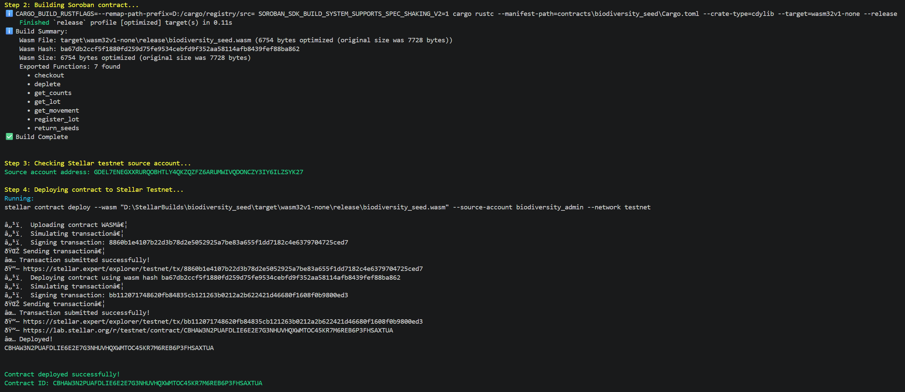
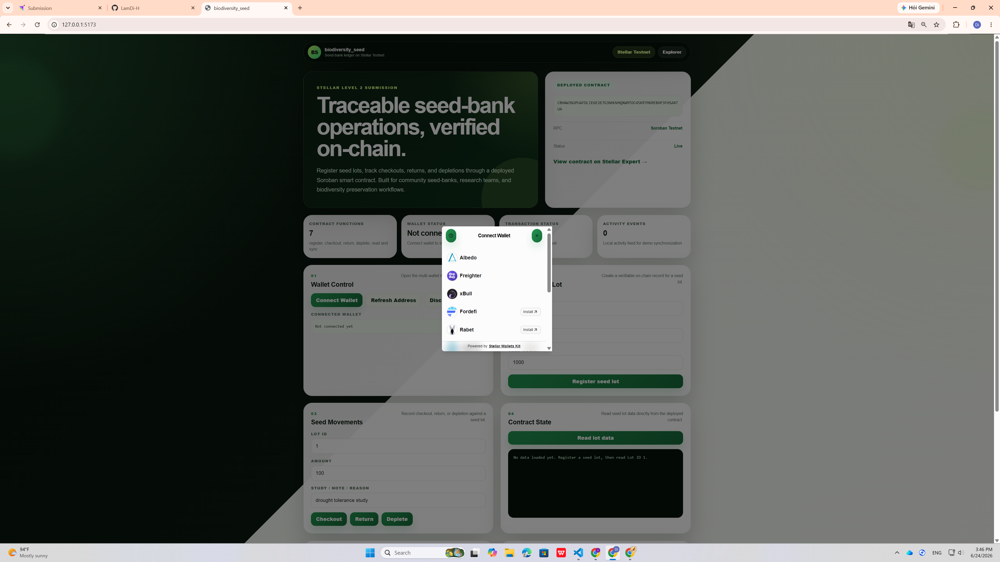
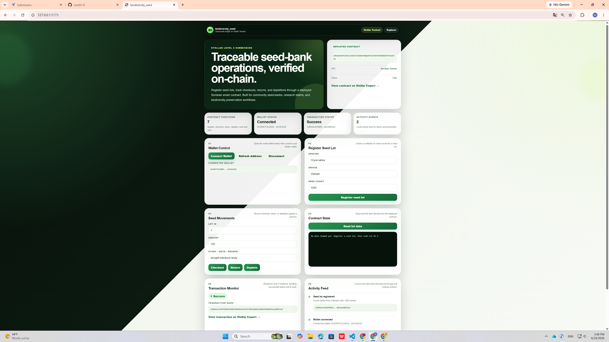
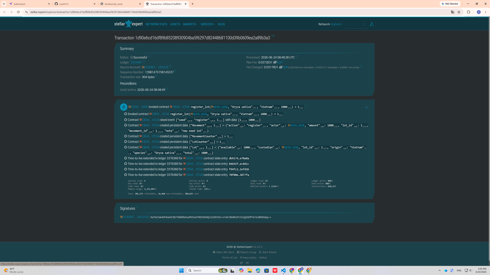
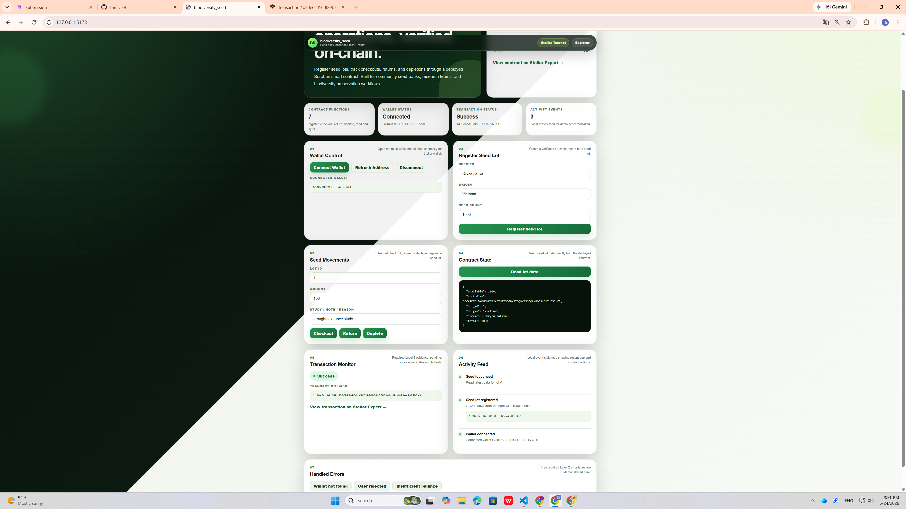
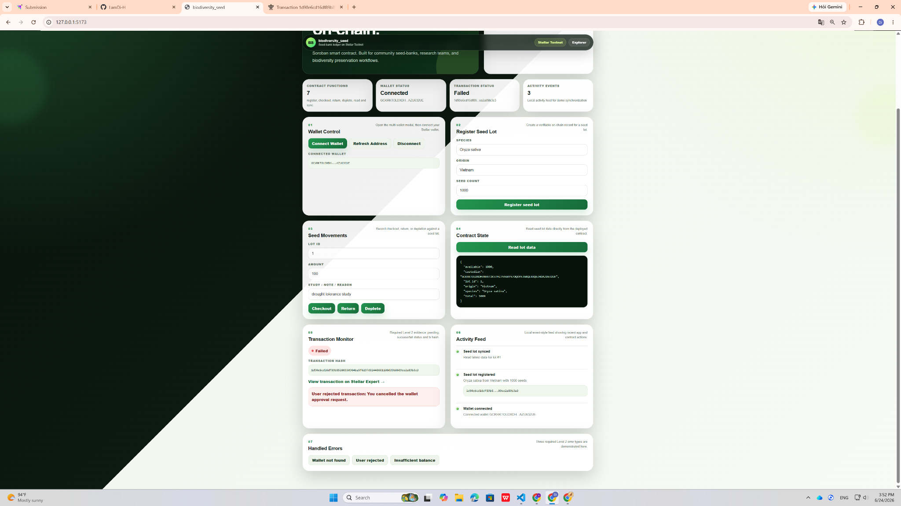

# biodiversity_seed

A Stellar Soroban Level 2 dApp for tracking biodiversity seed-bank operations on-chain.

## Project Description

`biodiversity_seed` is a Soroban smart contract and frontend dApp that turns a seed-bank ledger into an immutable on-chain record.

Community seed-banks often use paper ledgers or shared spreadsheets to track seed lots, loans, returns, and depletions. These systems are easy to mis-record and difficult to audit across institutions.

This project allows a custodian or researcher to:

* Register a seed lot with species, origin, and seed count
* Checkout seeds for research or study
* Return unused seeds
* Record seed depletion such as failed viability tests, in-house use, or expiry
* Read the latest seed lot state from the deployed Soroban contract
* Track transaction status and transaction hash from the frontend

The goal is to make seed-bank activity verifiable, transparent, and easier to audit across partner institutions.

---

## Project Vision

The long-term vision of `biodiversity_seed` is to support a globally accessible, community-governed network of biodiversity seed-banks.

Each seed lot can be traced from collection to research usage, while conservation activity can be verified through on-chain records. By anchoring seed-bank data on Stellar, biodiversity preservation workflows can become more transparent for researchers, custodians, funders, and regulators.

---

## Built With

* Stellar Soroban Smart Contract
* Rust
* Stellar CLI
* Stellar Testnet
* React
* TypeScript
* Vite
* Stellar Wallets Kit
* Stellar SDK

---

## Level 2 Requirements Covered

This project covers the Stellar Level 2 Yellow Belt requirements:

* Multi-wallet integration
* Smart contract deployed on Stellar Testnet
* Contract called from the frontend
* Transaction status visible in the UI
* Transaction hash visible in the UI
* Read and write data from the contract
* Event-style local activity feed
* 3 handled error types
* 2+ meaningful commits

---

## Smart Contract Features

The Soroban contract supports the following functions:

| Function       | Description                                                  |
| -------------- | ------------------------------------------------------------ |
| `register_lot` | Register a new seed lot with species, origin, and seed count |
| `checkout`     | Checkout seeds from an existing seed lot                     |
| `return_seeds` | Return unused seeds to a seed lot                            |
| `deplete`      | Record depletion of seeds from a lot                         |
| `get_lot`      | Read seed lot data                                           |
| `get_movement` | Read movement history                                        |
| `get_counts`   | Read total lot and movement counters                         |

---

## Deployed Contract

Contract deployed on Stellar Testnet:

```txt
CBHAW3N2PUAFDLIE6E2E7G3NHUVHQXWMTOC45KR7M6REB6P3FHSAXTUA
```

Stellar Expert contract link:

```txt
https://stellar.expert/explorer/testnet/contract/CBHAW3N2PUAFDLIE6E2E7G3NHUVHQXWMTOC45KR7M6REB6P3FHSAXTUA
```

---

## Contract Call Transaction Hash

Successful frontend contract call transaction hash:

```txt
1d90e6cd16df89b85208930904ba5f6297d82448681100d39b0609ea2a89b3a3
```

Stellar Expert transaction link:

```txt
https://stellar.expert/explorer/testnet/tx/PASTE_YOUR_TRANSACTION_HASH_HERE
```

---

## Screenshots / Evidence

### Contract Deployed



### Wallet Options Available



### Frontend Contract Call Success With Transaction Hash



### Stellar Expert Transaction Success



### Read Seed Lot Data From Contract



### Error Handling: Wallet Not Found


### Error Handling: User Rejected Transaction



### Error Handling: Insufficient Balance / Transaction Failed


---

## Handled Error Types

The frontend demonstrates 3 required Level 2 error types:

1. Wallet not found
2. User rejected transaction
3. Insufficient balance or transaction failed

These errors are shown in the Transaction Monitor panel.

---

## Local Setup Instructions

### 1. Clone the repository

```bash
git clone YOUR_REPOSITORY_URL
cd biodiversity_seed
```

### 2. Install Rust target

```bash
rustup target add wasm32v1-none
```

### 3. Test the smart contract

```bash
cargo test
```

### 4. Build the smart contract

```bash
stellar contract build
```

### 5. Frontend setup

```bash
cd frontend
npm install
npm run dev
```

The frontend will run locally at:

```txt
http://127.0.0.1:5173/
```

---

## Deploy Script

The project includes an automated deploy script:

```powershell
.\scripts\deploy-and-save.ps1
```

This script:

* Runs contract tests
* Builds the Soroban contract
* Deploys the contract to Stellar Testnet
* Saves the Contract ID to `CONTRACT_ID.txt`
* Updates `frontend/src/contractConfig.ts`

The frontend does not hardcode the Contract ID inside `App.tsx`.

---

## Frontend Setup Script

The project includes an automated frontend setup script:

```powershell
.\scripts\setup-frontend.ps1
```

This script creates the React frontend files, installs dependencies, and runs a production build check.

---

## How To Use The App

1. Open the frontend at `http://127.0.0.1:5173/`
2. Click `Connect Wallet`
3. Select a Stellar wallet such as Freighter
4. Make sure the wallet is on Stellar Testnet
5. Register a seed lot
6. Approve the transaction in the wallet
7. Wait for transaction status to become `Success`
8. Copy the transaction hash
9. Read Lot ID `1` to verify the contract state
10. Test the handled error buttons

---

## Example Seed Lot

```txt
Species: Oryza sativa
Origin: Vietnam
Seed count: 1000
```

---

## Repository Structure

```txt
biodiversity_seed
├── contracts
│   └── biodiversity_seed
│       ├── src
│       │   ├── lib.rs
│       │   └── test.rs
│       └── Cargo.toml
├── frontend
│   ├── src
│   │   ├── App.tsx
│   │   ├── App.css
│   │   ├── contractConfig.ts
│   │   └── main.tsx
│   ├── package.json
│   └── vite.config.ts
├── scripts
│   ├── deploy-and-save.ps1
│   └── setup-frontend.ps1
├── evidence
│   ├── contract-deployed.png
│   ├── wallet-options.png
│   ├── frontend-register-success-txhash.png
│   ├── stellar-expert-tx-success.png
│   ├── read-lot-data.png
│   ├── error-wallet-not-found.png
│   ├── error-user-rejected.png
│   └── error-insufficient-balance.png
├── CONTRACT_ID.txt
└── README.md
```

---

## Notes

This project was built for the Stellar Level 2 Yellow Belt submission.

The focus is on:

* Multi-wallet integration
* Deployed Soroban contract
* Frontend contract interaction
* Transaction status tracking
* Error handling
* Clear evidence for review
